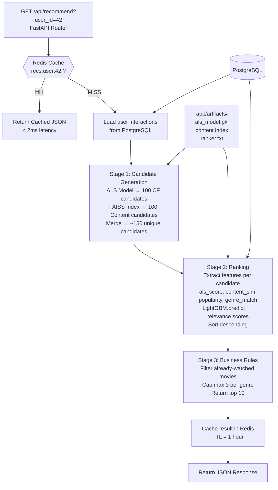

# 🤖 ReNet Recommendation Service — Internal Architecture

This document describes the complete internal architecture of the **FastAPI-based Recommendation Microservice** — the ML brain of the ReNet platform. It covers every layer from the HTTP endpoint down to the database and model artifacts.

---

## Architecture Diagram


---

## Request Flow (Mermaid)



---

## Folder Structure

```
ReNet_Recommendation/               ← Project Root
│
├── main.py                         ← FastAPI app + lifespan startup
├── seed_db.py                      ← One-time DB seeder script
├── .env                            ← DB_URL, REDIS config
├── requirements.txt
│
└── app/
    ├── config/
    │   ├── server_Config.py        ← Pydantic BaseSettings (reads .env)
    │   ├── db_Config.py            ← SQLAlchemy engine + connection test
    │   ├── reddis_config.py        ← Redis client
    │   └── artifacts_loader.py     ← Loads ML models into RAM on startup
    │
    ├── schemas/
    │   └── postgres_schema.py      ← SQLAlchemy ORM (User, Item, Interactions)
    │
    ├── repository/
    │   ├── crudOperations.py       ← Generic CRUDRepository[T] base class
    │   ├── user_repository.py      ← UserRepository extends CRUDRepository
    │   ├── item_repository.py      ← ItemRepository + update_poster()
    │   └── interaction_repository.py ← InteractionRepository + get_by_user()
    │
    ├── services/
    │   ├── recommendations.py      ← Full 3-stage ML pipeline
    │   └── retrain.py              ← (Planned) Auto-retraining script
    │
    ├── router/
    │   └── recommend.py            ← GET /api/recommend endpoint
    │
    ├── artifacts/                  ← Trained ML model files
    │   ├── als_model.pkl           ← ALS model + user/item ID mappings
    │   ├── content.index           ← FAISS vector index
    │   ├── content_item_ids.npy    ← Item ID array (maps FAISS row → item_id)
    │   ├── content_embeddings.npy  ← Sentence-Transformer embeddings
    │   ├── ranker.txt              ← LightGBM LambdaRank model
    │   └── ranker_features.json    ← Feature column names for ranker
    │
    ├── dataset/
    │   └── ml-latest-small/
    │       ├── movies.csv          ← 9743 movies (movieId, title, genres)
    │       └── ratings.csv         ← 100836 ratings (userId, movieId, rating)
    │
    └── notebook/
        └── RENET.ipynb             ← Original training notebook
```

---

## Layer-by-Layer Breakdown

### Layer 1: Configuration (`app/config/`)

All config files are initialized **once at import time** and shared as module-level singletons across the application.

| File | Responsibility |
|------|---------------|
| `server_Config.py` | Reads `.env` into a typed `Settings` object via Pydantic |
| `db_Config.py` | Creates the SQLAlchemy `engine`, tests the connection |
| `reddis_config.py` | Creates the Redis `client` connected to localhost:6379 |
| `artifacts_loader.py` | Loads `als_model.pkl`, `content.index`, `ranker.txt` into a `models` dict |

**Startup sequence in `main.py`:**
```python
@asynccontextmanager
async def lifespan(app):
    Base.metadata.create_all(bind=engine)  # Ensure DB tables exist
    load_models()                           # Load ML artifacts into RAM
    yield
```

---

### Layer 2: Schema (`app/schemas/`)

SQLAlchemy ORM models that map Python classes to PostgreSQL tables.

```python
class User(Base):
    __tablename__ = 'users'
    id = Column(Integer, primary_key=True)

class Item(Base):
    __tablename__ = 'items'
    id, title, genres, primary_genre, poster_url, plot

class Interactions(Base):
    __tablename__ = 'interactions'
    id, user_id → FK(users), item_id → FK(items), rating, event_type
```

**PostgreSQL Schema:**
```sql
users        (id)
items        (id, title, genres, primary_genre, poster_url, plot)
interactions (id, user_id, item_id, rating, event_type, created_at)
             + INDEX on user_id
             + INDEX on item_id
```

---

### Layer 3: Repository (`app/repository/`)

Generic CRUD base class with typed child repositories. No raw SQL in services.

```
CRUDRepository[T]          ← Generic base
  ├── get_all()
  ├── get_by_id(id)
  ├── create(obj)
  └── delete(id)

UserRepository(CRUDRepository[User])
ItemRepository(CRUDRepository[Item])
  └── update_poster(item_id, poster_url, plot)   ← custom method
InteractionRepository(CRUDRepository[Interactions])
  └── get_by_user(user_id)                        ← custom method
```

---

### Layer 4: Service — The ML Pipeline (`app/services/recommendations.py`)

This is the core of the system. Three sequential stages:

#### Stage 1: Candidate Generation
Finds ~150 potentially relevant movies for the user from two independent sources.

**Collaborative Filtering (ALS):**
```
user_id → user_id_to_idx → matrix row index
ALS.recommend(user_idx, user_item_matrix[user_idx], N=100)
→ [(item_idx, score), ...] → map back to real item_ids
```
*Captures: "users like you also watched..."*

**Content-Based Filtering (FAISS):**
```
user's positive items → look up their embeddings in content_embeddings.npy
→ compute mean user embedding vector
→ normalize vector
→ FAISS.search(user_vector, k=100)
→ returns nearest neighbour item_ids by cosine similarity
```
*Captures: "movies similar in description/genre to what you liked..."*

**Merge:**
Both sets are merged into a unified candidate pool (~150 items), with scores from both sources preserved. Items appearing in both get a combined signal.

---

#### Stage 2: Ranking (LightGBM LambdaRank)
Assigns a precise relevance score to each of the ~150 candidates.

**Feature extraction per candidate:**
| Feature | Source | Description |
|---------|--------|-------------|
| `als_score` | ALS model | Collaborative filtering score |
| `content_sim` | FAISS | Semantic similarity score |
| `popularity` | interactions table | Normalized watch count across all users |
| `genre_match` | item_genre dict | 1.0 if movie genre matches user's preferred genres |

```python
features = pd.DataFrame(candidate_rows)[feature_cols]
scores = ranker.predict(features)   # LightGBM LambdaRank
candidates.sort_values("score", ascending=False)
```

---

#### Stage 3: Business Rules (Reranking)
Applies non-ML business logic to the sorted list before returning.

```python
for candidate in sorted_candidates:
    if item_id in all_watched_items: continue        # Skip already seen
    if seen_genres[genre] >= 3: continue              # Max 3 per genre
    final.append(candidate)
    if len(final) >= 10: break                        # Return top 10
```

---

### Layer 5: Redis Caching

Wraps the entire ML pipeline with a cache.

```
Cache Key:  recs:user:{user_id}
Cache TTL:  3600 seconds (1 hour)
Cache HIT:  JSON.parse(redis.get(key))     → returns instantly
Cache MISS: run ML pipeline → redis.setex(key, 3600, JSON.dumps(result))
```

Cache should be **invalidated** when a user logs a new interaction so their next recommendation call reflects fresh data.

---

### Layer 6: Router (`app/router/recommend.py`)

Thin HTTP layer. No business logic — just delegates to the service.

```python
@router.get("/api/recommend")
def get_recommendations(user_id: int, n: int = 10):
    return {"user_id": user_id, "recommendations": recommend(user_id, n)}
```

---

## Data Flow Summary

```
.env file
   ↓ (read at import)
server_Config.py → Settings(DB_URL, HOST, REDIS_PORT)
   ↓
db_Config.py → engine (SQLAlchemy)
reddis_config.py → client (Redis)
artifacts_loader.py → models{als, faiss, ranker}
   ↓ (FastAPI startup)
main.py lifespan → create_all() + load_models()
   ↓
HTTP Request → router/recommend.py
   ↓
services/recommendations.py
   ├── Redis HIT? → Return
   └── MISS:
       ├── PostgreSQL → user interactions
       ├── ALS model → CF candidates
       ├── FAISS index → content candidates
       ├── LightGBM → ranked scores
       ├── Rerank → top 10
       └── Redis → cache result
          ↓
     JSON Response
```

---

## Key Design Decisions

| Decision | Reason |
|----------|--------|
| Models loaded into RAM at startup | Avoid disk I/O on every request |
| Redis cache in front of ML pipeline | ML inference is expensive (~200ms), cache brings it to < 2ms |
| 3-stage pipeline (generate → rank → rerank) | Industry standard (used by Netflix, YouTube, Spotify) |
| Generic CRUDRepository | DRY — avoid repeating get/create/delete per model |
| Pydantic Settings | Type-safe config, validates .env at startup before server accepts traffic |
| SQLAlchemy ORM | Database-agnostic — can switch from PostgreSQL to any other SQL DB |
